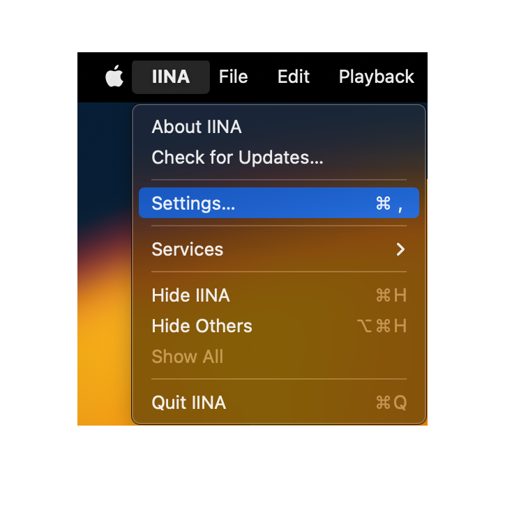
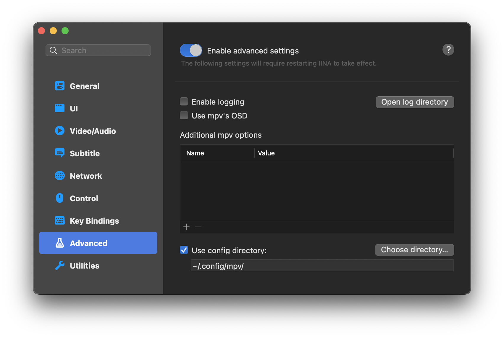

# Usage Instructions (GLSL / IINA) (v4.x)

## Installing and Setting Up Anime4K for IINA on Apple Silicon and Intel-based Mac

The easiest way to use Anime4K with IINA is to follow our `mpv` guide [**here**](GLSL_Instructions_Mac_MPV.md).
- *Note: you may need to create the `mpv` folder, if you did not install mpv.*

Then follow these steps:

1. Download the latest release of [IINA](https://iina.io/download/), if you haven't already.

2. Open IINA and click on `IINA` in the top menu bar. Then click on `Settings...` from the drop-down menu.
   
   

3. In the `Settings`>`Advanced` window, click on `Enable advanced settings` and then select `Use config directory: ~/.config/mpv/`.

   

4. That's it! Anime4K is now ready to use with IINA.

____
## Quick Usage Instructions

1. Anime4K has 3 major modes: A, B, and C. Each mode is optimized for a different class of anime degradations.
    - Mode A is automatically enabled, if you use our template (this can be change in `mpv.conf`).

2. To enable each mode manually:
    - Press **CTRL+1** to enable Mode A (Optimized for 1080p Anime).
    - Press **CTRL+2** to enable Mode B (Optimized for 720p Anime).
    - Press **CTRL+3** to enable Mode C (Optimized for 480p Anime).
    - Press **CTRL+0** to clear all shaders (Disable Anime4K).
    
3. For more explanations and customization options, see the [Advanced Usage Instructions](GLSL_Instructions_Advanced.md#advanced-usage-instructions-glsl--mpv-v4x).
