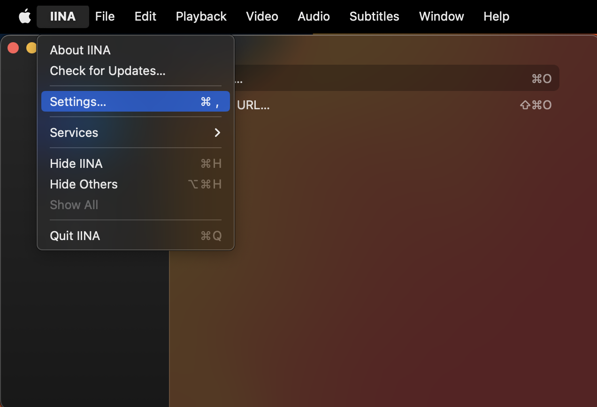

# Usage Instructions (GLSL / IINA) (v4.x)

## Installing and setting up Anime4K for IINA on Apple Silicon and Intel-based Mac

The easiest way to use Anime4K with IINA is to follow our mpv guide [**here**](GLSL_Instructions_Mac_MPV.md)
* Note: you may need to create the `mpv` folder, if you did not install mpv.

Then follow these steps:

  1. If you haven't already, download the latest release of [**IINA**](https://iina.io/download/)

  2. Open IINA and in the top menu, choose IINA > Settings... 
     

  3. In IINA Settings, click Enable advanced settings and then check Use config directory: `~/.config/mpv/` 
     
     
  4. That's it, Anime4K is now ready to use on IINA!
     ____
     
## Quick Usage Instructions

  1. Anime4K has 3 Major Modes: A, B and C. For more Advanced Explanation and Usage Instructions, click [**here**](md/GLSL_Instructions_Advanced.md#advanced-usage-instructions-glsl--mpv-v4x). 
     - By Default, Mode A is automatically enabled in our template (this can be change in mpv.conf)

  2. To enable each Mode Manually
     - Press CTRL+1 to enable Mode A (Recommended for 1080p)
     - Press CTRL+2 to enable Mode B (Recommended for 720p)
     - Press CTRL+3 to enable Mode C (Recommended for 480p)
     - Press CTRL+0 to clear and disable all the shaders.
