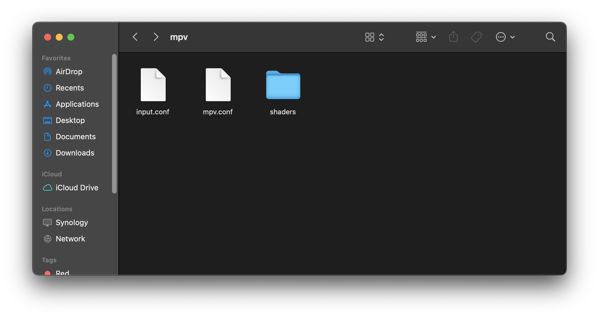

# Usage Instructions (GLSL / MPV) (v4.x)

## Installing and setting up Anime4K for Intel-based and Apple Silicon Mac
*If you wish to use another media player, look at their documentation on how to install GLSL shaders and modify the shader accordingly if needed.*

  1. Install mpv via [**Homebrew**](https://formulae.brew.sh/formula/mpv) or download the latest release [**here**](https://laboratory.stolendata.net/~djinn/mpv_osx/mpv-latest.tar.gz)
     - Note: Only the Homebrew version are built for Native Apple Silicon.
  2. Open mpv (this will create the mpv config file location for you)

  3. Download the template files, and extract it (double-click on the .zip file)
     - Optimized shaders for lower-end GPU: [**here**](Template/GLSL_Mac_Linux_Low-end.zip?raw=true)
       - *Eg. M1, M2*
     - Optimized shaders for higher-end GPU: [**here**](Template/GLSL_Mac_Linux_High-end.zip?raw=true)  
       - *Eg. M1 Pro, M1 Max, M1 Ultra, M2 Pro, M2 Max*<br>(Untested, might still have performance issues)

  4. In the Finder on your Mac, choose Go > Go to Folder.<br>
     
     
  5. Paste `~/.config/mpv/` and hit Enter<br>
     
     
  6. Move the template files here
     

----
**Optimized shaders for lower-end GPU:**  
*(Eg. M1, M2)*  
*If upscaling to resolutions smaller than 4K, lower end GPUs can be used.*  
```
CTRL+1 no-osd change-list glsl-shaders set "~~/shaders/Anime4K_Clamp_Highlights.glsl:~~/shaders/Anime4K_Restore_CNN_M.glsl:~~/shaders/Anime4K_Upscale_CNN_x2_M.glsl:~~/shaders/Anime4K_AutoDownscalePre_x2.glsl:~~/shaders/Anime4K_AutoDownscalePre_x4.glsl:~~/shaders/Anime4K_Upscale_CNN_x2_S.glsl"; show-text "Anime4K: Mode A (Fast)"
CTRL+2 no-osd change-list glsl-shaders set "~~/shaders/Anime4K_Clamp_Highlights.glsl:~~/shaders/Anime4K_Restore_CNN_Soft_M.glsl:~~/shaders/Anime4K_Upscale_CNN_x2_M.glsl:~~/shaders/Anime4K_AutoDownscalePre_x2.glsl:~~/shaders/Anime4K_AutoDownscalePre_x4.glsl:~~/shaders/Anime4K_Upscale_CNN_x2_S.glsl"; show-text "Anime4K: Mode B (Fast)"
CTRL+3 no-osd change-list glsl-shaders set "~~/shaders/Anime4K_Clamp_Highlights.glsl:~~/shaders/Anime4K_Upscale_Denoise_CNN_x2_M.glsl:~~/shaders/Anime4K_AutoDownscalePre_x2.glsl:~~/shaders/Anime4K_AutoDownscalePre_x4.glsl:~~/shaders/Anime4K_Upscale_CNN_x2_S.glsl"; show-text "Anime4K: Mode C (Fast)"
CTRL+4 no-osd change-list glsl-shaders set "~~/shaders/Anime4K_Clamp_Highlights.glsl:~~/shaders/Anime4K_Restore_CNN_M.glsl:~~/shaders/Anime4K_Upscale_CNN_x2_M.glsl:~~/shaders/Anime4K_Restore_CNN_S.glsl:~~/shaders/Anime4K_AutoDownscalePre_x2.glsl:~~/shaders/Anime4K_AutoDownscalePre_x4.glsl:~~/shaders/Anime4K_Upscale_CNN_x2_S.glsl"; show-text "Anime4K: Mode A+A (Fast)"
CTRL+5 no-osd change-list glsl-shaders set "~~/shaders/Anime4K_Clamp_Highlights.glsl:~~/shaders/Anime4K_Restore_CNN_Soft_M.glsl:~~/shaders/Anime4K_Upscale_CNN_x2_M.glsl:~~/shaders/Anime4K_AutoDownscalePre_x2.glsl:~~/shaders/Anime4K_AutoDownscalePre_x4.glsl:~~/shaders/Anime4K_Restore_CNN_Soft_S.glsl:~~/shaders/Anime4K_Upscale_CNN_x2_S.glsl"; show-text "Anime4K: Mode B+B (Fast)"
CTRL+6 no-osd change-list glsl-shaders set "~~/shaders/Anime4K_Clamp_Highlights.glsl:~~/shaders/Anime4K_Upscale_Denoise_CNN_x2_M.glsl:~~/shaders/Anime4K_AutoDownscalePre_x2.glsl:~~/shaders/Anime4K_AutoDownscalePre_x4.glsl:~~/shaders/Anime4K_Restore_CNN_S.glsl:~~/shaders/Anime4K_Upscale_CNN_x2_S.glsl"; show-text "Anime4K: Mode C+A (Fast)"

CTRL+0 no-osd change-list glsl-shaders clr ""; show-text "GLSL shaders cleared"
```
____
#### **Optimized shaders for higher-end GPU:**  
*(Eg. M1 Pro, M1 Max, M1 Ultra, M2 Pro, M2 Max)*  
*If upscaling to resolutions smaller than 4K, lower end GPUs can be used.*  
```
CTRL+1 no-osd change-list glsl-shaders set "~~/shaders/Anime4K_Clamp_Highlights.glsl:~~/shaders/Anime4K_Restore_CNN_VL.glsl:~~/shaders/Anime4K_Upscale_CNN_x2_VL.glsl:~~/shaders/Anime4K_AutoDownscalePre_x2.glsl:~~/shaders/Anime4K_AutoDownscalePre_x4.glsl:~~/shaders/Anime4K_Upscale_CNN_x2_M.glsl"; show-text "Anime4K: Mode A (HQ)"
CTRL+2 no-osd change-list glsl-shaders set "~~/shaders/Anime4K_Clamp_Highlights.glsl:~~/shaders/Anime4K_Restore_CNN_Soft_VL.glsl:~~/shaders/Anime4K_Upscale_CNN_x2_VL.glsl:~~/shaders/Anime4K_AutoDownscalePre_x2.glsl:~~/shaders/Anime4K_AutoDownscalePre_x4.glsl:~~/shaders/Anime4K_Upscale_CNN_x2_M.glsl"; show-text "Anime4K: Mode B (HQ)"
CTRL+3 no-osd change-list glsl-shaders set "~~/shaders/Anime4K_Clamp_Highlights.glsl:~~/shaders/Anime4K_Upscale_Denoise_CNN_x2_VL.glsl:~~/shaders/Anime4K_AutoDownscalePre_x2.glsl:~~/shaders/Anime4K_AutoDownscalePre_x4.glsl:~~/shaders/Anime4K_Upscale_CNN_x2_M.glsl"; show-text "Anime4K: Mode C (HQ)"
CTRL+4 no-osd change-list glsl-shaders set "~~/shaders/Anime4K_Clamp_Highlights.glsl:~~/shaders/Anime4K_Restore_CNN_VL.glsl:~~/shaders/Anime4K_Upscale_CNN_x2_VL.glsl:~~/shaders/Anime4K_Restore_CNN_M.glsl:~~/shaders/Anime4K_AutoDownscalePre_x2.glsl:~~/shaders/Anime4K_AutoDownscalePre_x4.glsl:~~/shaders/Anime4K_Upscale_CNN_x2_M.glsl"; show-text "Anime4K: Mode A+A (HQ)"
CTRL+5 no-osd change-list glsl-shaders set "~~/shaders/Anime4K_Clamp_Highlights.glsl:~~/shaders/Anime4K_Restore_CNN_Soft_VL.glsl:~~/shaders/Anime4K_Upscale_CNN_x2_VL.glsl:~~/shaders/Anime4K_AutoDownscalePre_x2.glsl:~~/shaders/Anime4K_AutoDownscalePre_x4.glsl:~~/shaders/Anime4K_Restore_CNN_Soft_M.glsl:~~/shaders/Anime4K_Upscale_CNN_x2_M.glsl"; show-text "Anime4K: Mode B+B (HQ)"
CTRL+6 no-osd change-list glsl-shaders set "~~/shaders/Anime4K_Clamp_Highlights.glsl:~~/shaders/Anime4K_Upscale_Denoise_CNN_x2_VL.glsl:~~/shaders/Anime4K_AutoDownscalePre_x2.glsl:~~/shaders/Anime4K_AutoDownscalePre_x4.glsl:~~/shaders/Anime4K_Restore_CNN_M.glsl:~~/shaders/Anime4K_Upscale_CNN_x2_M.glsl"; show-text "Anime4K: Mode C+A (HQ)"

CTRL+0 no-osd change-list glsl-shaders clr ""; show-text "GLSL shaders cleared"
```
____
## Usage Instructions for Anime4K

  1. Anime4K v4.x has 3 major modes: A, B and C. To enable one of the modes, press CTRL+1 for mode A, CTRL+2 for B and so on. CTRL+0 will clear and disable all the shaders. Each mode is optimized for a different class of anime degradations, explanations are in [Advanced Usage Instructions#modes](GLSL_Instructions_Advanced.md#modes) (soon in the wiki). For now you can just try each mode (starting from A) and use the one that looks the best.
  2. To verify the installation was correctly done, enable one of the Anime4K modes and use the MPV profiler to check if there are a few shaders with the name Anime4K running. To access the profiler, press Shift+I and then 2 on the keyboard's top row.  
This is what you should see (this example is from v2.0RC2, but also applies to newer versions):  

  3. For advanced usage and more customization options, see the [Advanced Usage Instructions](GLSL_Instructions_Advanced.md) page.
