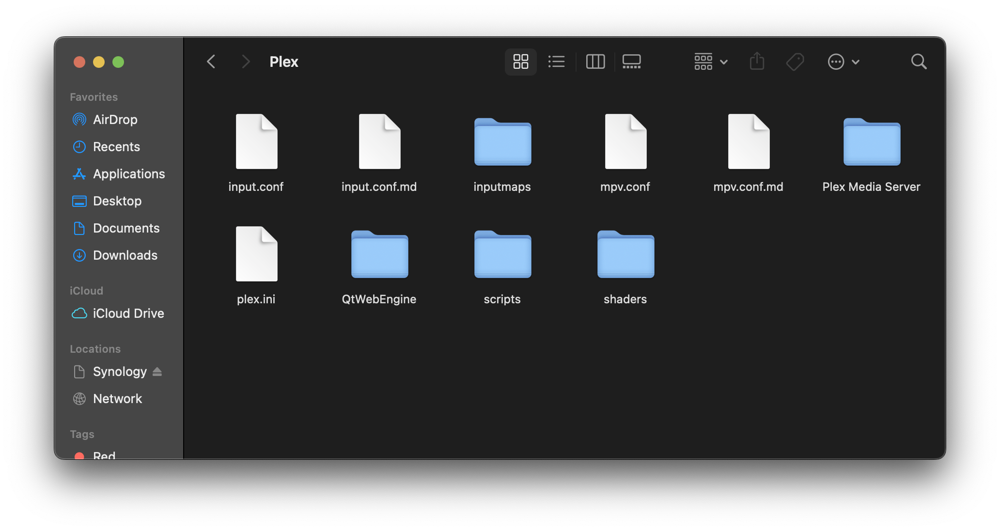

# Usage Instructions (GLSL / PLEX) (v4.x)

## Installing and setting up Anime4K for Plex on Apple Silicon and Intel-based Mac

  1. Install Plex for Mac or Plex HTPC from [**here**](https://www.plex.tv/media-server-downloads/#plex-app)  
 
  2. Open Plex or Plex HTPC (this will create the mpv config file location for you)

  3. Download the template files, and extract it (open the .zip file)
     - Optimized shaders for lower-end GPU: *Eg. M1, M2, Intel Chips*
       - Download template [**here**](Template/GLSL_Mac_Linux_Low-end.zip?raw=true) or maually copy the code from [**input.conf**](Template/GLSL_Mac_Linux_Low-end/input.conf) and [**mpv.conf**](Template/GLSL_Mac_Linux_Low-end/mpv.conf)
     - Optimized shaders for higher-end GPU: *Eg. Pro, Max, and Ultra, Intel Chips* (Untested)
       - Download template [**here**](Template/GLSL_Mac_Linux_High-end.zip?raw=true) or maually copy the code from [**input.conf**](Template/GLSL_Mac_Linux_High-end/input.conf) and [**mpv.conf**](Template/GLSL_Mac_Linux_High-end/mpv.conf)

  4. In the Finder on your Mac, choose Go > Go to Folder. 
     
     
  5. Paste `~/Library/Application Support/Plex/` or `~/Library/Application Support/Plex HTPC/` and hit Enter. 
     
     
     
  6. Move the template files (input.conf, mpv.conf and the shaders folder) to the Plex or Plex HTPC folder.
      
     
     
  7. That's it, Anime4K is now installed and ready to use!
     ____
     
## Quick Usage Instructions

  1. Anime4K has 3 Major Modes: A, B and C. For more Advanced Explanation and Usage Instructions, click [**here**](md/GLSL_Instructions_Advanced.md#advanced-usage-instructions-glsl--mpv-v4x). 
     - By Default, Mode A is automatically enabled in our template (this can be change in mpv.conf)

  2. To enable each Mode Manually
     - Press CTRL+1 to enable Mode A (Recommended for 1080p)
     - Press CTRL+2 to enable Mode B (Recommended for 720p)
     - Press CTRL+3 to enable Mode C (Recommended for 480p)
     - Press CTRL+0 to clear and disable all the shaders.
