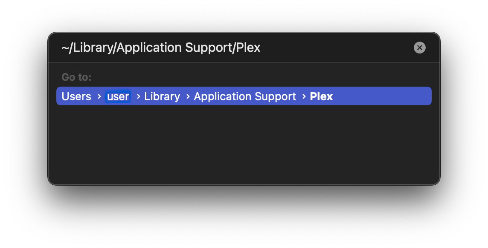

# Usage Instructions (GLSL / PLEX) (v4.x)

## Installing and Setting Up Anime4K for Plex on Apple Silicon and Intel-Based Mac

1. Download `Plex for Mac` or `Plex HTPC (for macOS Home Theater PCs)` from [**here**](https://www.plex.tv/media-server-downloads/#plex-app).  
   - *Note: Only the desktop version of the app supports GLSL shaders.*
 
2. Open `Plex` or `Plex HTPC` (this will create the Application Support location for you).

3. Download the template files and extract them (open the .zip file).

    - **Optimized shaders for lower-end GPU:**  
      *(Eg. M1, M2, Intel chips)*
        - Download the template files [here](https://github.com/Tama47/Anime4K/releases/download/v4.0.1/GLSL_Mac_Linux_Low-end.zip).
        - 

          
Or click here to install manually.

          <ul>
            <li>Copy & Paste the code from <a href="Template/GLSL_Mac_Linux_Low-end/input.conf">input.conf</a> and <a href="Template/GLSL_Mac_Linux_Low-end/mpv.conf">mpv.conf</a> in your <code>input.conf</code> and <code>mpv.conf</code> file.</li>
            <li>Then download and extract the shaders from <a href="https://github.com/bloc97/Anime4K/releases">releases</a> and put them in the <code>shaders</code> folder.</li>
         </ul>
         

    - **Optimized shaders for higher-end GPU:**  
      *(Eg. M1 Pro, M1 Max, M1 Ultra, M2 Pro, M2 Max, Intel chips)*  
       (Untested, might still have performance issues)  
        - Download the template files [here](https://github.com/Tama47/Anime4K/releases/download/v4.0.1/GLSL_Mac_Linux_High-end.zip).
        - 

          
Or click here to install manually.

          <ul>
            <li>Copy & Paste the code from <a href="Template/GLSL_Mac_Linux_High-end/input.conf">input.conf</a> and <a href="Template/GLSL_Mac_Linux_High-end/mpv.conf">mpv.conf</a> in your <code>input.conf</code> and <code>mpv.conf</code> file.</li>
            <li>Then download and extract the shaders from <a href="https://github.com/bloc97/Anime4K/releases">releases</a> and put them in the <code>shaders</code> folder.</li>
         </ul>
         

4. In the Finder on your Mac, choose `Go` > `Go to Folder...`

   
     
5. Paste `~/Library/Application Support/Plex/` or `~/Library/Application Support/Plex HTPC/` and hit Enter.

    
   
     
6. Move the `input.conf`, `mpv.conf`, and the `shaders` folder into the `Plex` or `Plex HTPC` folder.

    
   
     
7. That's it! Anime4K is now installed and ready to use.

____    
## Quick Usage Instructions

1. Anime4K has 3 major modes: A, B, and C. Each mode is optimized for a different class of anime degradations.
    - Mode A is automatically enabled, if you use our template (this can be change in `mpv.conf`).

2. To enable each mode manually:
    - Press **CTRL+1** to enable Mode A (Optimized for 1080p Anime).
    - Press **CTRL+2** to enable Mode B (Optimized for 720p Anime).
    - Press **CTRL+3** to enable Mode C (Optimized for 480p Anime).
    - Press **CTRL+0** to clear all shaders (Disable Anime4K).
    
3. For more explanations and customization options, see the [Advanced Usage Instructions](GLSL_Instructions_Advanced.md#advanced-usage-instructions-glsl--mpv-v4x).
