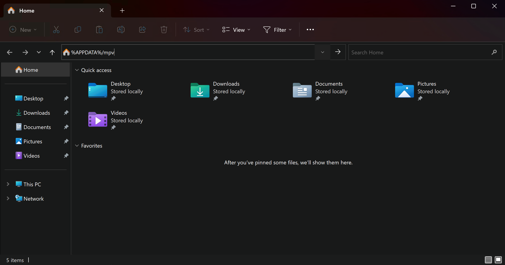
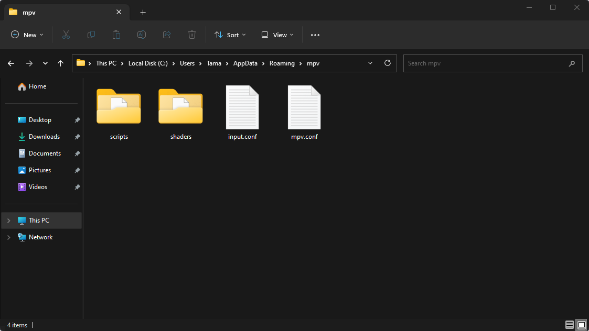

# Usage Instructions (GLSL / MPV) (v4.x)

## Installing and setting up Anime4K for mpv on Windows
*If you wish to use another media player, look at their documentation on how to install GLSL shaders and modify the shader accordingly if needed.*

  1. Download the latest release of mpv [**here**](https://sourceforge.net/projects/mpv-player-windows/files/latest/download). 

  2. Open mpv (this will create the mpv config file location for you)

  3. Download the template files, and extract it (open the .zip file)
     - **Optimized shaders for lower-end GPU:**  
       *(Eg. GTX 980, GTX 1060, RX 570)*
       - Download the template files [**here**](https://github.com/Tama47/Anime4K/releases/download/v4.0.1/GLSL_Windows_Low-end.zip)
       - Or maually copy the code from [**input.conf**](Template/GLSL_Windows_Low-end/input.conf) and [**mpv.conf**](Template/GLSL_Windows_Low-end/mpv.conf)
     - **Optimized shaders for higher-end GPU:**  
       *(Eg. GTX 1080, RTX 2070, RTX 3060, RX 590, Vega 56, 5700XT, 6600XT)* 
       - Download the template files [**here**](https://github.com/Tama47/Anime4K/releases/download/v4.0.1/GLSL_Windows_High-end.zip)
       - Or maually copy the code from [**input.conf**](Template/GLSL_Windows_High-end/input.conf) and [**mpv.conf**](Template/GLSL_Windows_High-end/mpv.conf)

  4. Open File Explorer and type in `%APPDATA%/mpv`
 
     

  5. Move the template files (input.conf, mpv.conf and the shaders folder) to the mpv folder.

     
     
  6. That's it, Anime4K is now installed and ready to use!

____    
## Quick Usage Instructions

  1. Anime4K has 3 Major Modes: A, B and C. Each mode is optimized for a different class of anime degradations. For more explanations and customization options, see the [**Advanced Usage Instructions**](md/GLSL_Instructions_Advanced.md#advanced-usage-instructions-glsl--mpv-v4x) 
     - By Default, Mode A is automatically enabled in our template (this can be change in mpv.conf)

  2. To enable each Mode manually
     - Press CTRL+1 to enable Mode A (Optimized for 1080p Anime)
     - Press CTRL+2 to enable Mode B (Optimized for 720p Anime)
     - Press CTRL+3 to enable Mode C (Optimized for 480p Anime)
     - Press CTRL+0 to clear all shaders (Disable Anime4K)
