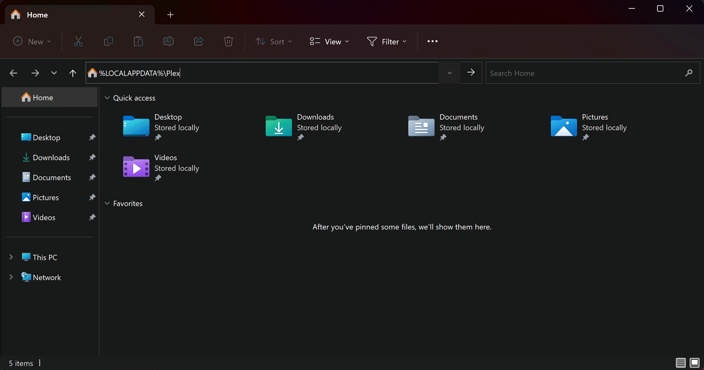
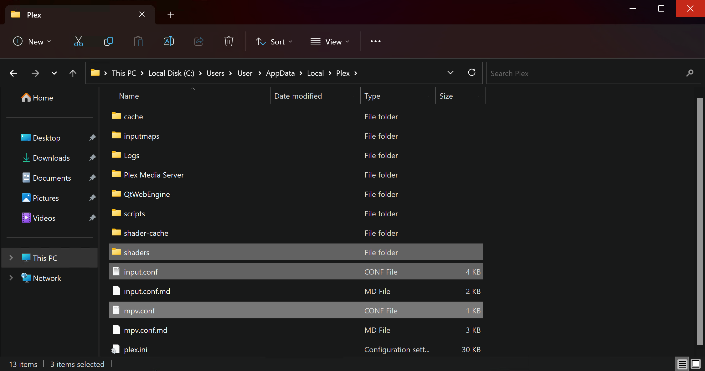

# Usage Instructions (GLSL / PLEX) (v4.x)

## Installing and setting up Anime4K for Plex on Apple Silicon and Intel-based Mac

  1. Download Plex for Windows or Plex HTPC (for Windows Home Theater PCs) from [**here**](https://www.plex.tv/media-server-downloads/#plex-app)  
     - *Note: Only the desktop version of the app supports GLSL shaders*
 
  2. Open Plex or Plex HTPC (this will create the config location for you)

  3. Download the template files, and extract it (open the .zip file)
     - Optimized shaders for lower-end GPU: *Eg. GTX 980, GTX 1060, RX 570*
       - Download template [**here**](Template/GLSL_Windows_Low-end.zip?raw=true) or maually copy the code from [**input.conf**](Template/GLSL_Windows_Low-end/input.conf) and [**mpv.conf**](Template/GLSL_Windows_Low-end/mpv.conf)
     - Optimized shaders for higher-end GPU: *Eg. GTX 1080, RTX 2070, RTX 3060, RX 590, Vega 56, 5700XT, 6600XT*
       - Download template [**here**](Template/GLSL_Windows_High-end.zip?raw=true) or maually copy the code from [**input.conf**](Template/GLSL_Windows_High-end/input.conf) and [**mpv.conf**](Template/GLSL_Windows_High-end/mpv.conf)

  4. Open File Explorer and type in `%APPDATA%/Plex` or `%APPDATA%/Plex HTPC`
 
     
     
     
  5. Move the template files (input.conf, mpv.conf and the shaders folder) to the Plex or Plex HTPC folder.

     
      
     
  6. That's it, Anime4K is now installed and ready to use!
     ____
     
## Quick Usage Instructions

  1. Anime4K has 3 Major Modes: A, B and C. Each mode is optimized for a different class of anime degradations. For more explanations and customization options, see the [**Advanced Usage Instructions**](md/GLSL_Instructions_Advanced.md#advanced-usage-instructions-glsl--mpv-v4x) 
     - By Default, Mode A is automatically enabled in our template (this can be change in mpv.conf)

  2. To enable each Mode manually
     - Press CTRL+1 to enable Mode A (best for 1080p anime)
     - Press CTRL+2 to enable Mode B (best for 720p anime)
     - Press CTRL+3 to enable Mode C (best for 480p anime)
     - Press CTRL+0 to clear and disable all the shaders
